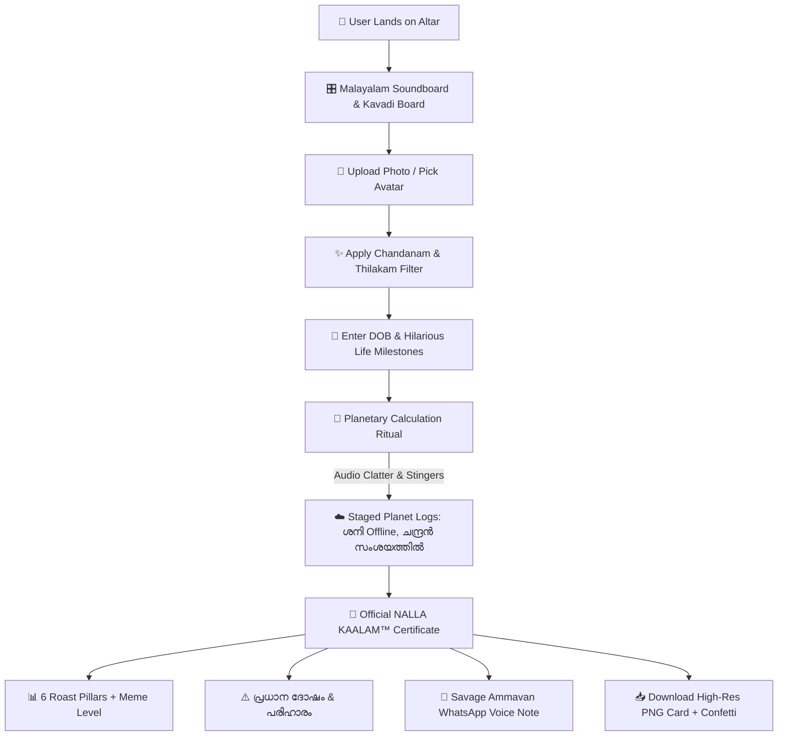

# NALLA KAALAM™ (നല്ല കാലം) 🔮
> *“നിങ്ങളുടെ ജാതകം നോക്കിയതാണ്... ഇനി അനുഭവിച്ചോളൂ.”*

A Malayalam meme + fake astrology + personality roasting machine that has zero practical utility, maximum entertainment, and certified 1990s Kerala astrologer shop aesthetics.

---

## Basic Details
### Team Name: Jathaka.exe (നവഗ്രഹ റോസ്റ്റേഴ്സ്)

### Team Members
- Team Lead: [Deena George] - [Viswajyothi College of Engineering And Technology]
- Member 2: [Bilja K Saji] - [Viswajyothi College of Engineering And Technology]


### Project Description
NALLA KAALAM™ is an AI-powered parody astrological divination engine that takes your photo and date of birth to calculate completely unnecessary, unsolicited, and deeply personal roasts about your lifestyle. Styled like an authentic 1990s Kerala astrologer's parlour with cursed bureaucratic seals, it features interactive Kavadi dice physics, live Chandanakuri face filters, and savage WhatsApp audio notes from your boomer uncle.

### The Problem (that doesn't exist)
Modern science, NASA, and high-tech algorithms are completely ignoring the most devastating cosmic crises facing Kerala's youth today:
- Opening Instagram to check one message and losing 2.5 hours watching Russian soap-cutting videos.
- Saying "നാളെ മുതൽ കട്ടക്ക് തുടങ്ങും" for 4 consecutive years.
- Waiting until 11:58 PM for a 11:59 PM deadline to channel Einstein's soul.
- Having ₹37.50 left in your bank account right after Swiggy biriyani arrives.

No traditional horoscope was brave enough to address these real tragedies.

### The Solution (that nobody asked for)
We engineered a full-stack fake astrology portal that:
1. **AI Face Reading™ (100% Fiction)**: Scans your selfie with red laser sweeps to diagnose sleep deprivation and missing luck (*"404 ഭാഗ്യം Not Found"*).
2. **✨ Live Chandanam & Thilakam Filter**: Automatically paints 3 authentic Sandalwood/Vibhuti lines and a red Kumkum Thilakam dot on your forehead via HTML5 Canvas.
3. **🐚 Interactive Kavadi Rolling Board**: Procedural Web Audio dice physics allowing users to roll 6 shells for immediate comic fate.
4. **📊 6 Pillars of Fate**: Scientific-looking percentage bars for ബുദ്ധി (87% - not used), പ്രണയം (43%), സമ്പത്ത് (12%), and ഫോൺ ഉപയോഗം (94%).
5. **👴 Savage Ammavan Voice Note Simulator**: A realistic WhatsApp audio player with animated waveform bars that plays procedural boomer babble (*"ആദ്യം ആ ഫോൺ താഴെ വെക്ക്!"*).
6. **📥 Official Downloadable Certificate**: Exports a high-res, share-ready Malayalam Jathakam card with a giant `OFFICIALLY 100% USELESS` rubber stamp for WhatsApp Status and Instagram Stories.

---

## Technical Details

### Technologies/Components Used
For Software:
- **Languages**: JavaScript (ES6+), HTML5, Vanilla CSS3 (Custom 1990s Parchment Design System)
- **Frameworks**: React 18, Vite 5
- **Libraries**:
  - `html-to-image` (High-resolution PNG card rendering)
  - `canvas-confetti` (Celebratory particle explosions)
  - `lucide-react` (Crisp iconography)
- **Audio Synthesis**: Built-in **Web Audio API** procedural synthesizer (Temple bell harmonics, Kavadi shell rattling noise envelopes, dramatic tritone stingers, and cartoon voice babbles — 100% offline with zero external audio assets).
- **Tools**: VS Code, Git, Google Fonts (*Manjari, Gayathri, Cinzel*)

---

### Implementation

#### Installation
```bash
# Clone the repository
git clone https://github.com/[your-username]/nalla-kaalam.git

# Navigate into the project folder
cd nalla-kaalam

# Install dependencies
npm install
```

#### Run
```bash
# Start local development server
npm run dev

# Or build for production preview
npm run build
npm run preview
```

Open [http://localhost:5174/](http://localhost:5174/) in your browser.

---

## Project Documentation

### Screenshots

  
*Landing Altar: The 1990s Kerala Astrologer Parlour featuring Nilavilakku oil lamps and the iconic CTA "🔮 എന്റെ ജീവിതം നശിപ്പിക്കൂ".*

  
*AI Face Scanner HUD: Real-time laser scanning reticle with the "✨ ചന്ദനക്കുറി വരയ്ക്കൂ" filter painted on HTML5 Canvas.*

  
*Official Jathakam Certificate: 12-House Rasichakram, 6 Pillars of Fate, Relatable Dosham Card, and Savage Ammavan WhatsApp audio player.*

---

### Diagrams

#### System Architecture & User Flow


*Flow of user inputs through the facial decoration pipeline, planetary calculation logs, and exportable Jathakam card.*

---


## Team Contributions
- **[Deena George]**: Core application architecture, React state flow, Web Audio synthesizer, and TinkerHub submission setup.
- **[Bilja K Saji]**: 1990s Kerala astrologer Vanilla CSS design system, parchment textures, and Rasichakram 12-house grid.


---

Made with ❤️ at TinkerHub Useless Projects 


